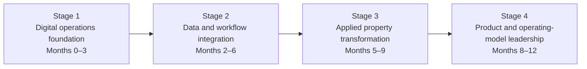

# 12-Month Development Roadmap

## Stage 1 — Digital operations foundation

**Timing:** Months 0–3

Process mapping, service design, data literacy, cloud concepts, security basics, stakeholder analysis and transformation governance.

**Evidence:** five current-state process maps, system/data register, KPI dictionary, 90-day backlog and cloud/Power Platform learning records.

## Stage 2 — Data and workflow integration

**Timing:** Months 2–6

Data dictionary, source-of-truth design, Power Query controls, Power BI modelling, connectors, automation, approvals, audit and exception handling.

**Evidence:** integrated sample dataset, data-quality report, dashboard v1, low-risk automation prototype, tests and feedback.

## Stage 3 — Applied property transformation

**Timing:** Months 5–9

Pilot workflows for onboarding, collections, maintenance, document control, municipal accounts and owner reporting.

**Evidence:** pilot charter, future-state maps, benefits baseline, architecture sketch, implementation plan and executive presentation.

## Stage 4 — Product and operating-model leadership

**Timing:** Months 8–12

Business case, roadmap, vendor governance, adoption, service levels, commercial model, scale and continuous improvement.

**Evidence:** target operating model, RACI, service catalogue, 12–24 month roadmap, cost assumptions, risk register and decision pack.

## Recommended formal credential order

1. Microsoft Azure Fundamentals — AZ-900.
2. Microsoft Power Platform Fundamentals — PL-900.
3. Microsoft Azure AI Fundamentals — AI-901.
4. Google Cloud Digital Leader.
5. Power BI or Google Data Analytics pathway.
6. Applied Lean, Six Sigma or business-process-management foundation.

A formal credential attempt follows applied evidence. Each exam must be supported by at least one relevant process map, decision brief, automation, dashboard, data model, risk register or implementation retrospective.
